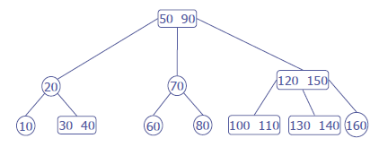

# Textbook Exercises - Week 5

- Section 6.1, #6 (page 206)

- Section 6.1, #7

- (Section 6.3) List the following numbers in an insertion order that would result in the following AVL tree structure. The order of insertions should incur at least one rotation.

  

- (Section 6.3) List the following numbers in an insertion order that would result in the following 2-3 tree structure:

  

- Section 6.3, #8 (page 226)

- Section 6.5, #7 and #8 (page 240)

- Section 6.6, #2 (page 248)

- Section 6.6, #6 (page 248) **or** #9 (page 249)
  (Besides a general description, give a concrete example of your algorithm in action.)

