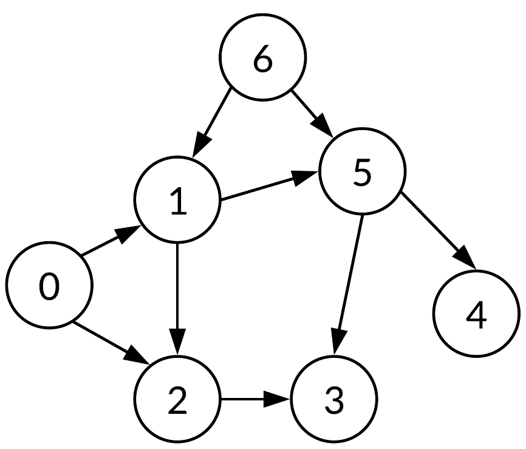

# Reading Questions - Section 4.2

1. Can the graph in Figure 1.6(b) be topologically sorted? Explain.

2. Use the DFS-based algorithm to find a topological ordering of the following graph. Show a trace of the vertices visited as the DFS progresses.

   

3. Use the source removal algorithm to find a topological ordering of the graph above. List the order in which vertices are removed.

4. What is the computational complexity of the source removal algorithm? Justify your answer.

